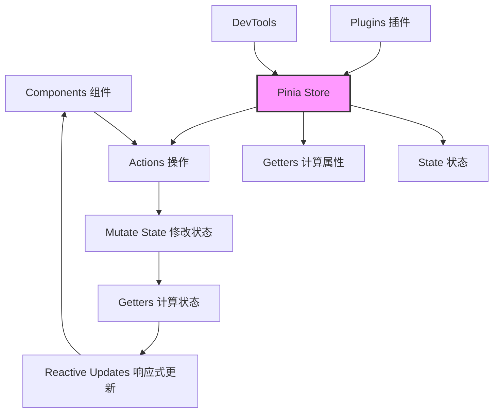

# 🍍 Pinia 状态管理笔记

<div align="center">


**直观、类型安全、可扩展的 Vue 状态管理库**

[](https://vuejs.org/)
[](https://www.typescriptlang.org/)
[](https://bundlephobia.com/package/pinia)

> 官方推荐，下一代 Vue 状态管理方案

</div>

## 📖 目录

- [🌟 核心概念](#-核心概念)
- [🚀 快速开始](#-快速开始)
- [🏪 Store 详解](#-store-详解)
- [🔧 高级特性](#-高级特性)
- [🆚 Pinia vs Vuex](#-pinia-vs-vuex)
- [💡 最佳实践](#-最佳实践)
- [📚 资源推荐](#-资源推荐)

---

## 🌟 核心概念

### 为什么选择 Pinia？

| 特性              | 说明                                       | 优势                           |
| ----------------- | ------------------------------------------ | ------------------------------ |
| **直观的 API**    | 类似组件 `setup()` 的 Composition API 风格 | 学习成本低，Vue 开发者上手快   |
| **类型安全**      | 完整的 TypeScript 支持                     | 开发时类型推断，减少运行时错误 |
| **模块化设计**    | 多个独立的 store，自动代码分割             | 更好的组织代码，按需加载       |
| **DevTools 支持** | Vue DevTools 深度集成                      | 时间旅行调试，状态追踪         |
| **轻量级**        | 约 1KB 大小                                | 对应用性能影响极小             |

### 核心架构图



---

## 🚀 快速开始

### 1. 安装

```bash
# 使用 npm
npm install pinia

# 使用 yarn
yarn add pinia

# 使用 pnpm
pnpm add pinia
```

### 2. 基础配置

```javascript
// main.js / main.ts
import { createApp } from 'vue';
import { createPinia } from 'pinia';
import App from './App.vue';

// 创建 Pinia 实例
const pinia = createPinia();

// 创建 Vue 应用
const app = createApp(App);

// 使用 Pinia
app.use(pinia);

app.mount('#app');
```

### 3. 第一个 Store

```typescript
// stores/counter.ts
import { defineStore } from 'pinia';

// 选项式 API 风格
export const useCounterStore = defineStore('counter', {
  // 状态（相当于组件的 data）
  state: () => ({
    count: 0,
    name: 'Pinia Counter',
  }),

  // 计算属性（相当于组件的 computed）
  getters: {
    doubleCount: state => state.count * 2,
    // 访问其他 getter
    doubleCountPlusOne(): number {
      return this.doubleCount + 1;
    },
  },

  // 操作方法（相当于组件的 methods）
  actions: {
    increment() {
      this.count++;
    },
    incrementBy(amount: number) {
      this.count += amount;
    },
    // 异步操作
    async incrementAsync() {
      const response = await fetch('/api/increment');
      const data = await response.json();
      this.count += data.amount;
    },
  },
});
```

### 4. 在组件中使用

```vue
<!-- Component.vue -->
<template>
  <div class="counter">
    <h1>{{ store.name }}</h1>
    <p>Count: {{ store.count }}</p>
    <p>Double Count: {{ store.doubleCount }}</p>
    <button @click="store.increment">+1</button>
    <button @click="store.incrementBy(5)">+5</button>
    <button @click="reset">Reset</button>
  </div>
</template>

<script setup>
import { useCounterStore } from '@/stores/counter';
import { storeToRefs } from 'pinia';

// 获取 store 实例
const store = useCounterStore();

// 解构并保持响应式
const { count, name } = storeToRefs(store);

// 直接解构 actions
const { increment, incrementBy } = store;

// 重置状态
function reset() {
  store.$reset();
}
</script>
```

---

## 🏪 Store 详解

### 1. State（状态）

```typescript
// stores/user.ts
export const useUserStore = defineStore('user', {
  state: () => ({
    // 推荐显式定义类型
    user: null as User | null,
    token: '',
    preferences: {
      theme: 'light' as 'light' | 'dark',
      language: 'zh-CN',
    },
    // 数组和对象
    recentSearches: [] as string[],
    // 嵌套对象
    profile: {
      avatar: '',
      bio: '',
    },
  }),

  // 访问状态
  actions: {
    updateProfile(updates: Partial<User>) {
      // 直接修改
      if (this.user) {
        Object.assign(this.user, updates);
      }

      // 或者使用 $patch
      this.$patch({
        user: { ...this.user, ...updates },
      });
    },
  },
});
```

### 2. Getters（计算属性）

```typescript
export const useProductStore = defineStore('products', {
  state: () => ({
    products: [] as Product[],
    filter: '',
  }),

  getters: {
    // 基本 getter
    productCount: state => state.products.length,

    // 带参数的 getter
    filteredProducts: state => {
      return (category?: string) => {
        let filtered = state.products;
        if (category) {
          filtered = filtered.filter(p => p.category === category);
        }
        if (state.filter) {
          filtered = filtered.filter(p =>
            p.name.toLowerCase().includes(state.filter.toLowerCase())
          );
        }
        return filtered;
      };
    },

    // 使用其他 getter
    expensiveProducts(): Product[] {
      return this.filteredProducts().filter(p => p.price > 100);
    },

    // 异步 getter（不推荐，但可用）
    async productDetails(): Promise<ProductDetail[]> {
      const details = await fetchDetails(this.products.map(p => p.id));
      return details;
    },
  },
});
```

### 3. Actions（操作）

```typescript
export const useAuthStore = defineStore('auth', {
  state: () => ({
    user: null as User | null,
    loading: false,
    error: null as string | null,
  }),

  actions: {
    // 同步操作
    setUser(user: User) {
      this.user = user;
      this.error = null;
    },

    // 异步操作
    async login(credentials: LoginCredentials) {
      this.loading = true;
      this.error = null;

      try {
        const response = await api.login(credentials);
        this.user = response.user;
        localStorage.setItem('token', response.token);
        return response;
      } catch (error: any) {
        this.error = error.message;
        throw error;
      } finally {
        this.loading = false;
      }
    },

    // 组合多个 actions
    async loginAndFetchData(credentials: LoginCredentials) {
      const result = await this.login(credentials);
      await this.fetchUserData();
      return result;
    },

    // $patch 批量更新
    updateMultiple(values: Partial<AuthState>) {
      this.$patch({
        ...values,
        updatedAt: new Date().toISOString(),
      });
    },
  },
});
```

---

## 🔧 高级特性

### 1. 插件系统

```typescript
// plugins/persistence.ts
import { PiniaPluginContext } from 'pinia';

export function persistencePlugin(context: PiniaPluginContext) {
  const { store } = context;
  const storageKey = `pinia-${store.$id}`;

  // 从 localStorage 恢复状态
  const stored = localStorage.getItem(storageKey);
  if (stored) {
    store.$patch(JSON.parse(stored));
  }

  // 监听状态变化并保存
  store.$subscribe((mutation, state) => {
    localStorage.setItem(storageKey, JSON.stringify(state));
  });

  return { persistence: true };
}

// 使用插件
const pinia = createPinia();
pinia.use(persistencePlugin);
```

### 2. 组合式 Store

```typescript
// composables/useFetch.ts
export function useFetch<T>(url: string) {
  const data = ref<T | null>(null);
  const error = ref<string | null>(null);
  const loading = ref(false);

  async function execute() {
    loading.value = true;
    try {
      const response = await fetch(url);
      data.value = await response.json();
    } catch (err: any) {
      error.value = err.message;
    } finally {
      loading.value = false;
    }
  }

  return { data, error, loading, execute };
}

// 在 store 中使用组合式函数
export const usePostsStore = defineStore('posts', () => {
  // 状态
  const posts = ref<Post[]>([]);
  const selectedCategory = ref('all');

  // 使用组合式函数
  const { data, error, loading, execute } = useFetch<Post[]>('/api/posts');

  // 计算属性
  const filteredPosts = computed(() => {
    if (selectedCategory.value === 'all') {
      return posts.value;
    }
    return posts.value.filter(post => post.category === selectedCategory.value);
  });

  // 操作
  async function fetchPosts() {
    await execute();
    if (data.value) {
      posts.value = data.value;
    }
  }

  function setCategory(category: string) {
    selectedCategory.value = category;
  }

  // 返回所有内容
  return {
    posts,
    selectedCategory,
    filteredPosts,
    error,
    loading,
    fetchPosts,
    setCategory,
  };
});
```

### 3. TypeScript 强化

```typescript
// types/index.ts
export interface User {
  id: number;
  name: string;
  email: string;
  role: 'admin' | 'user' | 'guest';
}

export interface Product {
  id: string;
  name: string;
  price: number;
  category: string;
  inStock: boolean;
}

// 扩展 Store 类型
declare module 'pinia' {
  export interface PiniaCustomProperties {
    // 添加自定义方法
    $customMethod: () => void;

    // 添加路由实例
    $router: Router;
  }

  export interface PiniaCustomStateProperties<S> {
    // 添加状态属性
    createdAt: string;
  }
}

// 类型安全的 store
export const useTypedStore = defineStore('typed', {
  state: () => ({
    users: [] as User[],
    currentUser: null as User | null,
    products: new Map<string, Product>(),
  }),

  getters: {
    // 类型推断的 getter
    adminUsers(): User[] {
      return this.users.filter(user => user.role === 'admin');
    },

    // 带参数的类型安全 getter
    getProduct: state => {
      return (id: string): Product | undefined => {
        return state.products.get(id);
      };
    },
  },

  actions: {
    // 类型安全的 action
    addUser(user: Omit<User, 'id'>) {
      const newUser: User = {
        ...user,
        id: this.users.length + 1,
      };
      this.users.push(newUser);
    },

    // 泛型方法
    updateItem<T extends keyof State>(key: T, value: State[T]) {
      this[key] = value;
    },
  },
});
```

### 4. 测试 Store

```typescript
// __tests__/counter.spec.ts
import { setActivePinia, createPinia } from 'pinia';
import { useCounterStore } from '@/stores/counter';
import { describe, it, expect, beforeEach } from 'vitest';

describe('Counter Store', () => {
  beforeEach(() => {
    // 创建一个新的 pinia 实例
    setActivePinia(createPinia());
  });

  it('should increment counter', () => {
    const store = useCounterStore();
    expect(store.count).toBe(0);

    store.increment();
    expect(store.count).toBe(1);
  });

  it('should compute double count', () => {
    const store = useCounterStore();
    store.count = 5;

    expect(store.doubleCount).toBe(10);
  });

  it('should handle async actions', async () => {
    const store = useCounterStore();

    await store.incrementAsync();
    // 断言异步操作的结果
  });

  it('should reset state', () => {
    const store = useCounterStore();
    store.count = 10;
    store.name = 'Test';

    store.$reset();

    expect(store.count).toBe(0);
    expect(store.name).toBe('Pinia Counter');
  });
});
```

---

## 🆚 Pinia vs Vuex

### 对比表

| 特性                | Pinia                         | Vuex 4              |
| ------------------- | ----------------------------- | ------------------- |
| **API 风格**        | Composition API + Options API | Options API         |
| **TypeScript 支持** | 一流的支持，完整的类型推断    | 需要额外的类型定义  |
| **模块系统**        | 多个独立 store，自动代码分割  | 单一 store 中的模块 |
| **大小**            | ~1KB                          | ~10KB               |
| **DevTools 支持**   | 内置，时间旅行调试            | 需要配置            |
| **热更新**          | 支持模块热替换                | 有限支持            |
| **学习曲线**        | 平缓，与 Vue 3 一致           | 较陡，有自己的概念  |

### 迁移指南

```typescript
// Vuex 写法
const store = new Vuex.Store({
  state: {
    count: 0,
  },
  mutations: {
    INCREMENT(state) {
      state.count++;
    },
  },
  actions: {
    incrementAsync({ commit }) {
      setTimeout(() => {
        commit('INCREMENT');
      }, 1000);
    },
  },
  getters: {
    doubleCount: state => state.count * 2,
  },
});

// 等效的 Pinia 写法
export const useCounterStore = defineStore('counter', {
  state: () => ({ count: 0 }),
  actions: {
    increment() {
      this.count++;
    },
    async incrementAsync() {
      setTimeout(() => {
        this.increment();
      }, 1000);
    },
  },
  getters: {
    doubleCount: state => state.count * 2,
  },
});
```

---

## 💡 最佳实践

### 1. Store 组织架构

```
src/stores/
├── index.ts              # 导出所有 store
├── auth.store.ts        # 认证相关
├── user.store.ts        # 用户数据
├── cart.store.ts        # 购物车
├── products.store.ts    # 商品数据
├── ui.store.ts          # UI 状态（主题、侧边栏等）
└── types/              # TypeScript 类型定义
    ├── index.ts
    ├── user.types.ts
    └── product.types.ts
```

### 2. 状态设计原则

```typescript
// 好的实践：单一职责，扁平化结构
export const useAuthStore = defineStore('auth', {
  state: () => ({
    // ✅ 扁平化，避免深层嵌套
    user: null as User | null,
    token: '',
    permissions: [] as string[],
  }),
});

// 避免：过度嵌套，职责不清
export const useBadStore = defineStore('bad', {
  state: () => ({
    // ❌ 过度嵌套，难以维护
    app: {
      auth: {
        user: {
          /* ... */
        },
        token: '',
      },
      ui: {
        /* ... */
      },
      data: {
        /* ... */
      },
    },
  }),
});
```

### 3. 性能优化技巧

```vue
<template>
  <!-- ❌ 错误：整个 store 响应式监听 -->
  <div>{{ store.count }}</div>

  <!-- ✅ 正确：只监听需要的部分 -->
  <div>{{ count }}</div>

  <!-- ✅ 使用 computed 缓存计算结果 -->
  <div>{{ formattedCount }}</div>
</template>

<script setup>
import { useCounterStore } from '@/stores/counter';
import { storeToRefs } from 'pinia';
import { computed } from 'vue';

const store = useCounterStore();

// 使用 storeToRefs 解构并保持响应式
const { count } = storeToRefs(store);

// 复杂的计算使用 computed 缓存
const formattedCount = computed(() => {
  return `Count: ${count.value}`;
});

// 避免在模板中直接调用 getter 函数
// ❌ <div>{{ store.filteredProducts('category') }}</div>
// ✅ 先在 script 中计算
const filteredProducts = computed(() => store.filteredProducts('category'));
</script>
```

### 4. 错误处理模式

```typescript
export const useApiStore = defineStore('api', {
  state: () => ({
    data: null as any,
    loading: false,
    error: null as Error | null,
  }),

  actions: {
    async fetchData() {
      // 1. 重置状态
      this.loading = true;
      this.error = null;

      try {
        // 2. 执行异步操作
        const response = await fetch('/api/data');

        if (!response.ok) {
          throw new Error(`HTTP ${response.status}`);
        }

        // 3. 更新状态
        this.data = await response.json();
        return this.data;
      } catch (error: any) {
        // 4. 统一错误处理
        this.error = error;

        // 5. 可以在这里添加全局错误处理
        console.error('API Error:', error);

        // 6. 重新抛出错误，让组件可以处理
        throw error;
      } finally {
        // 7. 清理状态
        this.loading = false;
      }
    },
  },
});
```

---

## 📚 资源推荐

### 工具插件

- [Pinia Plugin Persist](https://github.com/prazdevs/pinia-plugin-persist) - 持久化插件
- [Pinia Testing](https://github.com/posva/pinia/testing) - 测试工具
- [Vue DevTools](https://devtools.vuejs.org/) - 必备调试工具

---

## 🎯 总结

Pinia 通过简洁的 API、出色的 TypeScript 支持和优秀的开发体验，已经成为 Vue 3 生态中**状态管理的默认选择**。它的设计哲学与 Vue 3 的 Composition API 高度一致，让开发者可以用更直观的方式管理应用状态。

**关键要点**：

1. **轻量简单**：约 1KB 大小，API 直观易学
2. **类型安全**：完整的 TypeScript 支持，开发体验好
3. **模块化**：独立的 store，支持自动代码分割
4. **组合式**：与 Vue 3 Composition API 完美结合
5. **工具完善**：DevTools 深度集成，调试方便

对于新项目，**强烈推荐直接使用 Pinia**。对于现有 Vuex 项目，可以在新模块中尝试 Pinia，逐步迁移。

> 本文档将持续更新。最后更新于 2024年3月15日。如有错误或补充，欢迎提交 Issue 或 PR。

---
