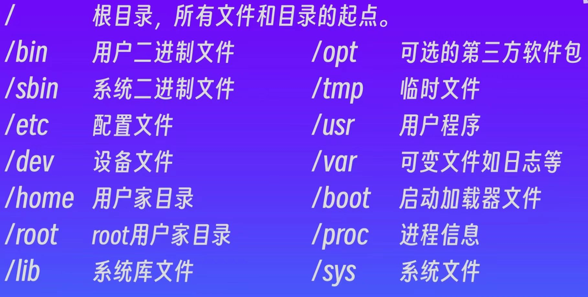

# File

**一切皆文件 Everything is a file**
> [Linux命令大全](https://www.linuxcool.com/)
> 
> [Linux 命令搜索](https://wangchujiang.com/linux-command/list.html)



### ls

列出目录及文件名

- -a ：全部的文件，连同隐藏文件( 开头为 . 的文件) 一起列出来(常用)
- -d ：仅列出目录本身，而不是列出目录内的文件数据(常用)
- -l ：长数据串列出，包含文件的属性与权限等等数据；(常用)

### cd 切换目录

### pwd 显示目前的目录

- **-P** ：显示出确实的路径，而非使用连结 (link) 路径。

### mkdir

创建一个新的目录

- -m ：配置文件的权限。
- -p ：帮助你直接将所需要的目录(包含上一级目录)递归创建起来！

```shell
mkdir -p test1/test2/test3/test4
```

### rmdir

删除一个空的目录

- **-p ：**从该目录起，一次删除多级空目录
- 空目录才能删除，里面有个空文件夹，也算有内容，不能删除。

```shell
rmdir /a/b/c/d # 删除空文件夹 d
rmdir -p /a/b/c/d # 删除 a b c d
```

### cp

复制文件或目录

- -r：若给出的源文件是一个目录文件，此时将复制该目录下所有的子目录和文件。
- -a：此选项通常在复制目录时使用，它保留链接、文件属性，并复制目录下的所有内容。其作用等于dpR参数组合。
- -d：复制时保留链接。这里所说的链接相当于 Windows 系统中的快捷方式。
- -f：覆盖已经存在的目标文件而不给出提示。
- -i：与 **-f** 选项相反，在覆盖目标文件之前给出提示，要求用户确认是否覆盖，回答 **y** 时目标文件将被覆盖。
- -p：除复制文件的内容外，还把修改时间和访问权限也复制到新文件中。
- -l：不复制文件，只是生成链接文件。

### rm

删除文件或目录

```shell
rm file

# -f 表示直接删除
# -r 表示目录下的所有文件删除
# -i ：互动模式，主动询问，避免你删除到错误的档名！

# 删除当前目录下的所有文件及目录
rm -r  * 

# 跑路
rm -rf /*
 ```

### mv

移动文件与目录，或修改文件与目录的名称

- -f ：force 强制的意思，如果目标文件已经存在，不会询问而直接覆盖；
- -i ：若目标文件 (destination) 已经存在时，就会询问是否覆盖！
- -u ：若目标文件已经存在，且 source 比较新，才会升级 (update)

```shell
# 文件改名
mv index.html index2.html
# 隐藏文件，文件名上加上 . 
mv index.html .index.html

# 仅仅移动
mv  /home/www/index.html   /home/static/
# 移动又重命名
mv /home/www/index.html   /home/static/index2.html
# 批量移动
mv  /home/www/website/*  /home/www/static
```

### cat

1. 显示文件内容

- -A ：相当於 -vET 的整合选项，可列出一些特殊字符而不是空白而已；
- -b ：列出行号，仅针对非空白行做行号显示，空白行不标行号！
- -E ：将结尾的断行字节 $ 显示出来；
- -n ：列印出行号，连同空白行也会有行号，与 -b 的选项不同；
- -T ：将 [tab] 按键以 ^I 显示出来；
- -v ：列出一些看不出来的特殊字符

2. 连接文件

```shell
# 把 textfile1 的文档内容加上行号后输入 textfile2 这个文档里：
cat -n textfile1 > textfile2
# 把 textfile1 和 textfile2 的文档内容加上行号（空白行不加）之后将内容附加到 textfile3 文档里
cat -b textfile1 textfile2 >> textfile3
# 清空 /etc/test.txt 文档内容：
cat /dev/null > /etc/test.txt
```

### tac 从尾部看

从最后一行开始显示，可以看出 tac 是 cat 的倒着写！

### nl 显示行号

### more 按页显示

### less 按页显示

与 more 类似，但是比 more 更好的是，可以往前翻页！
less运行时可以输入的命令有：

- 空白键 ：向下翻动一页；
- [pagedown]：向下翻动一页；
- [pageup] ：向上翻动一页；
- /字串 ：向下搜寻『字串』的功能；
- ?字串 ：向上搜寻『字串』的功能；
- n ：重复前一个搜寻 (与 / 或 ? 有关！)
- N ：反向的重复前一个搜寻 (与 / 或 ? 有关！)
- q ：离开 less 这个程序；

### head 只看头几行

### tail 只看尾巴几行

    - -n ：后面接数字，代表显示几行的意思

### touch 创建文件

  ```shell
  # 文件存在，修改时间属性
  # 不存在，创建文件
  touch new_file
  ```

### echo 打印输出

```shell
echo "\"test content\""
# 创建/覆盖文件
echo "test content" > index.html
# 追加内容
echo "test content" >> index.html
```

### chown

文件所有者、群组和其他人所属

(1) user (2) group (3) others，

u g o a 代表 all

r: read 4
w: write 2
e: execute 1

- chgrp ：改变文件所属群组

- chown：改变文件所有者

- chmod：改变文件权限

```shell
# 4+2+1 = 7
chmod 777
chmod u=rwx,go=rx .filename
chmod a+w .filename
chmod a-w .filename
```

### tar

#### 打包

- `-c`：表示创建一个新的tar文件。
- `-z`：表示使用gzip进行压缩。
- `-f`：表示指定输出的文件名，后面紧跟要打包的文件和目录。

```shell
# 打包一个tar
tar cvf etcbak.tar etc/ 

# 打包压缩一个 gz
tar cvzf etcbak.tar.gz etc/ 
```

#### 解压

- `-x`：表示解压缩一个已经存在的tar文件。
- `-z`：表示使用gzip进行解压缩。
- `-v`：表示输出详细信息，可以看到解压缩过程中的每个文件。
- `-f`：表示指定要解压的tar文件名，后面紧跟要解压缩到的目录。
- `-C`：表示指定解压缩到的目录

```sh
# 解开一个tar
tar xvf etcbak.tar  
#  解压一个 gz
tar xzvf etcbak.tar.gz  -C /etc/bin
```

### find

- name：根据文件名查找。区分大小写。
- iname：根据文件名查找，不区分大小写。
- type：根据文件类型查找
    - f：普通文件

    - d：目录

    - l：符号链接

    - b：块设备文件

    - c：字符设备文件

    - p：管道文件

    - s：套接字文件
- size
  +n：查找大于 n 单位的文件
  -n：查找小于 n 单位的文件
  n：查找恰好为 n 单位的文件
  ```shell
  # 大于 100M 
  find . -type f -iname "*l" -size +100M
  ```

- mtime

  按文件最后修改时间查找。时间以天为单位。例如：
- -n
  查找在 n 天内修改的文件
  +n：查找在 n 天前修改的文件
  n：查找在 n 天前（即第 n 天）修改的文件
- -atime：按文件最后访问时间查找。时间以天为单位。
- -ctime：按文件状态更改时间查找。时间以天为单位。
- -mmin、-amin、-cmin：这些选项分别按分钟查找文件的最后修改时间、最后访问时间和状态更改时间。
  按权限搜索：
- -perm：根据文件权限查找。例如，find /path -perm 755 查找路径 /path 下权限为 755 的文件。
  按用户和组搜索：
- -user：按文件所有者查找。例如，find /path -user username 查找路径 /path 下属于用户 username 的文件。
  group：按文件所属组查找。例如，find /path -group groupname 查找路径 /path 下属于组 groupname 的文件。
- -uid：按用户 ID 查找文件所有者。
- -gid：按用户组 ID 查找文件所属组。
  其他选项：
- -empty：查找空文件或空目录。
- -maxdepth：限制搜索的最大深度。例如，find /path -maxdepth 2 查找路径 /path 下深度不超过 2 的文件和目录。
- -mindepth：限制搜索的最小深度。
- -exec：对找到的每个文件执行指定的命令。例如，find /path -name "*.txt" -exec rm {} \; 删除路径 /path 下所有 .txt 文件。
- -ok：与 -exec 类似，但在执行命令前会提示用户确认。
- -delete：直接删除找到的文件或目录。使用时要小心。
- -print：打印找到的文件名（默认操作）。
- -printf：自定义输出格式。
- -follow：如果遇到符号链接文件，跟踪至连接所指向的文件。
- -path：根据文件路径查找，支持通配符。
- -regex：使用正则表达式匹配整个路径。
- -iregex：不区分大小写的正则表达式匹配。
- -links：按硬链接数查找文件。
- -xdev 或 -mount：限制搜索在当前文件系统内，不跨文件系统。