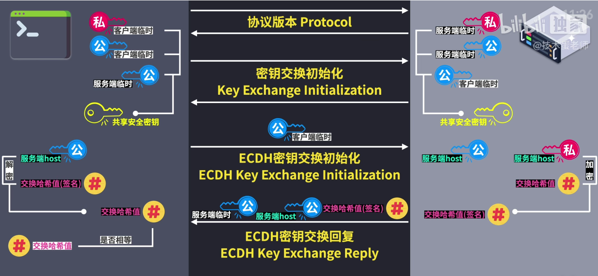

# SSH

## SSH协议握手核心过程

1. 首先进行 TCP 三次握手.
2. 之后进行 ssh 握手,确认 SSH 协议版本, SSH1、SSH2 版本不同,加密方式也不同.
3. 密钥信息初始化,确定生成密钥的算法,生成临时公私钥.
4. 服务端和客服端交换临时公钥,双方用自己的临时公私密钥和对方的临时公钥生成共享安全密钥.
5. 服务端生成`host公私钥`和`交换哈希值`,用`host私钥`对`交换哈希值`进行加密,生成 **交换哈希值(签名)**.
    - `交换哈希值`: 共享安全密钥+双方临时密钥+服务端host公钥+客服端和服务端交换初始化负载信息+客服端和服务端版本号.
6. 服务端把`host公钥`和加密生成的**交换哈希值(签名)** 发给客服端.
7. 客户端使用`host公钥`对**交换哈希值(签名)** 解密,得到`交换哈希值`,校验服务端的`交换哈希值`是否相同.
8. 校验成功后,双方各生成新的6个密钥,两个数据加密密钥,两个数据完整性密钥,两个加强密钥.


::: tip 参考
[SSH协议握手核心过程](https://www.bilibili.com/video/BV13P4y1o76u/)
:::

## ssh-keygen

ssh-keygen
- -f
   指定了私钥文件的名称和位置
- -t
  指定了密钥的类型。
- -C
  为生成的密钥添加一个注释（comment）

```shell
# 如果不带任何参数运行`ssh-keygen`
# 它将提示用户输入保存密钥的文件位置（默认是`~/.ssh/id_rsa`，表示使用RSA算法生成的私钥）
# 以及是否需要一个密码短语（passphrase）来保护私钥
ssh-keygen -t rsa

# Generating public/private rsa key pair.
# Enter file in which to save the key (/root/.ssh/id_rsa): 
# Enter passphrase (empty for no passphrase): 
# Enter same passphrase again: 

ssh-keygen -f fileName -t rsa -C "dequan@example.com"
ssh-keygen -t rsa -C "2889597857@qq.com"
```

## ssh-copy-id

将公钥拷贝到指定服务器的 **~/.ssh/authorized_keys** 文件中

```shell
ssh-copy-id [-i [identity_file]] [user@]hostname
```

- -i [identity_file]：指定要使用的公钥文件。如果不指定，默认使用 ~/.ssh/id_rsa.pub 或 ~/.ssh/id_dsa.pub 等。
- [user@]hostname：指定远程服务器的用户名和地址。如果不指定用户名，则默认使用当前用户名。


`ssh-keygen` 是一个用于生成、管理和转换认证密钥的工具，主要用于SSH（Secure Shell）协议的安全认证。SSH是一种网络协议，用于加密两台计算机之间的通信，保证数据的安全传输。`ssh-keygen`生成的密钥对包括一个公钥和一个私钥，公钥可以安全地分享给任何你希望与之进行SSH连接的服务器或设备，而私钥则必须保密，用于解密从服务器接收到的加密信息。

以下是`ssh-keygen`的一些常用选项和功能：

1. **生成新的密钥对**：
   ```bash
   ssh-keygen
   ```

2. **指定密钥类型和长度**：
   ```bash
   ssh-keygen -t rsa -b 4096
   ```
   这个命令指定生成一个使用RSA算法的密钥对，长度为4096位。`-t`选项用于指定密钥类型（如`rsa`, `dsa`, `ecdsa`, `ed25519`等），`-b`选项用于指定密钥的位数。

3. **生成一个新的密钥对，并指定保存位置**：
   ```bash
   ssh-keygen -f ~/.ssh/my_custom_key
   ```
   这个命令将在`~/.ssh/`目录下生成名为`my_custom_key`的私钥和`my_custom_key.pub`的公钥。

4. **修改现有密钥的密码短语**：
   ```bash
   ssh-keygen -p -f ~/.ssh/id_rsa
   ```
   这个命令会提示用户输入当前密钥的密码短语（如果有的话），然后输入新的密码短语。

5. **显示公钥内容**：
   ```bash
   ssh-keygen -y -f ~/.ssh/id_rsa
   ```
   这个命令将显示指定私钥对应的公钥内容。`-y`选项用于表示“显示公钥”。

6. **列出已知的主机密钥**：
   ```bash
   ssh-keygen -l -f ~/.ssh/known_hosts
   ```
   这个命令会列出`~/.ssh/known_hosts`文件中存储的所有已知主机密钥的指纹。`-l`选项用于显示指纹。

7. **删除`known_hosts`文件中的条目**：
   虽然`ssh-keygen`本身不直接提供删除`known_hosts`文件中特定条目的命令，但你可以通过编辑该文件来手动删除。不过，使用`-R`选项可以移除特定主机的密钥：
   ```bash
   ssh-keygen -R hostname
   ```
   这个命令会从`known_hosts`文件中移除与`hostname`相关联的所有密钥。

`ssh-keygen`是SSH安全认证机制的核心工具之一，掌握它的基本用法对于维护SSH连接的安全性至关重要。